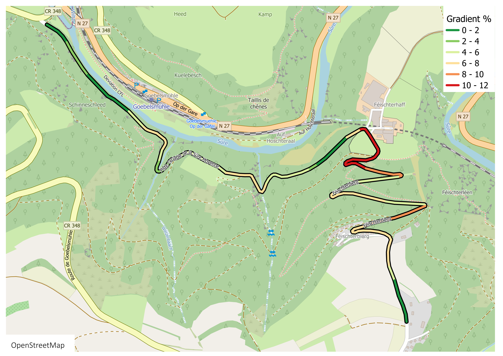

On Saturday, 27th of June 2026 the Panaché Vëlo gang is taking on an Everesting challenge in Luxembourg!

Join us to climb **full** (8 848m) or **half** (4 424m) elevation of mount Everest, or just to **support** the climbers.

For more information on the Everesting challenge and the rules, visit [everesting.com](https://everesting.com)

## Where

We'll climb the Féischterbierg climb, which starts from Göbelsmuhle and arrives almost to Bourscheid.

## How many laps?

The climb is about 3.6 km long with an elevation of 200m. That is, 40 laps for the full everesting, and 20 for the half.

You can play with the lap calculator to see climb times: [everesting.com/lap-calculator/](https://everesting.com/lap-calculator/)

And, of course, the Strava segment: [www.strava.com/segments/670567](https://www.strava.com/segments/670567)

## When

Saturday, 27th of June 2026. Group start at 4.30 am at the base of the climb.

Supporters are welcome to join any time!

## Wanna join?

If you want to take up the challenge with us, or just come for support, please DM us on Instagram [@panache_velo](https://www.instagram.com/panache_velo/), or drop an email to panachevelo@gmail.com before the 22nd of June.

## What to expect

Good friends and great vibes to help us power through the long hours together!

There will also be a permanent **self-organised** feeding station with food and water at the top of climb. We will provide a stand and some basics, climbers and supporters are expected to bring enough food and water for themselves.

Restrooms available at the Gare at the basis of the climb.

Everyone who joins will receive a special keepsake to celebrate the day and show off later 🏅🏅🏅

## How to get there

Important: there are no trains from Luxembourg that day!

There is plenty of parking at the [Goebelsmuhle Gare](https://maps.app.goo.gl/trouUfCizsn9je4LA).

The ride will take place only with good weather.

